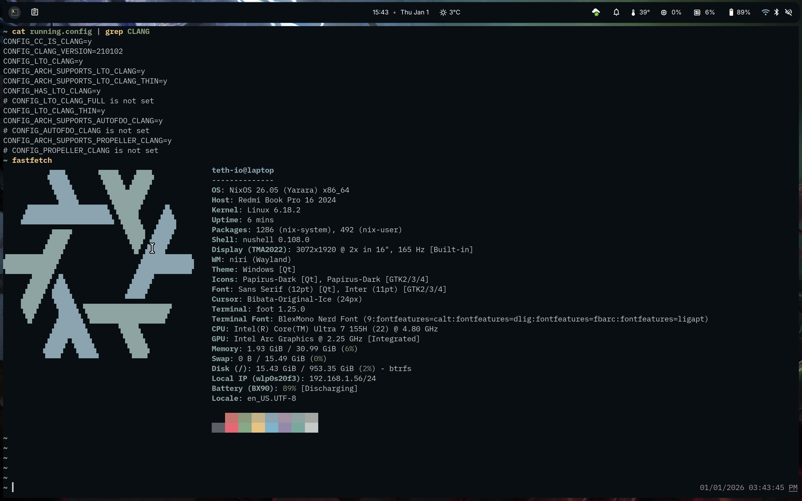

collections de configurations d'OS declaratives, immutables et reproductibles  
Installation automatisé  
Maintenant GitOps avec maj et maintenance automatique (scrubbing, trimming, snapshots, garbage collection, ...)  
moderne (zfs, btrfs, zram, ...)  
Sécurisé (FDE, zpool chiffré, SOPS)  
optimizé (tcp fast open, bbr, parametrage des FS, kernel march=native et thinlto...)

# NixOS

NixOS est **déclaratif** (OS as Code) ce qui permet une grande capacité de customisation, une simplicité de configuration et de maintenance tout en gardant une **reproductibilitée** de l’OS désiré.  
Il est aussi **immutable** et garde à disposition le paramétarge et les binaires précédents ce qui permet de pouvoir **rollback** dans les versions précédentes de l’OS en cas de problème.  
Les mise à jours sont **atomiques**, comme les transactions d'un base de donnée, ce qui permet de s'assurer que le system n'est pas cassé suite au changement.

Cette distribution n’est pas parfaite, elle ne propose pas de MAC (Mandatory Access Control) et le secure-boot (lanzaboote) n’est pas encore upstream

## flake.nix inputs

Des modules sont diponibles afin d’élargire ses fonctionnalités. Exemple :
- home-manager : permet de preparer les environnements utilisateurs directement depuis les fichiers de configuration nix, la configuration est donc declarative.  
- SOPS-Nix : SOPS est un outil permettant de chiffré les secrets contenu dans des fichier afin de pouvoir les stocker et utiliser de manière sécurisé. SOPS-nix permet de gérer ces secrets de façon déclaratif (e.g. ici le pool zfs est chiffré et s’ouvre au démarrage avec une clef déchiffré et exposé par SOPS-nix)

Installation se fait ici à partir de l'iso minimal par ssh avec [nixos-anywhere](https://github.com/nix-community/nixos-anywhere/blob/main/docs/quickstart.md)

## flake.nix outputs

On désigne ici plusieurs nixosConfigurations, une par installation (server, pc portable, ...).  
Chacune avec les modules quelle utiliseront : inputs et la configuration à suivre (./server/server.nix; ./laptop/laptop.nix)

> [!WARNING]
> Le hostname doit correspondre au nom de la configuration pour le programme de maj identifie la configuration à appliquer

## Installation

Doit se faire depuis un NixOS (qu'importe la version) vers une machine faisant tourner le media d'instalation NixOS en LTS (sinon l'installation plantera a cause de la compatibilité ZFS)  
Besoin de flake :
- `nano /etc/nixos/configuration.nix`

ajouter `nix.settings.experimental-features = [ "nix-command" "flakes" ];`

Pour rebuild et passer à la nouvelle version du système :
- `nixos-rebuild switch`

anywhere est lancé avec une commande :

`nix run github:nix-community/nixos-anywhere -- --generate-hardware-config nixos-facter ./facter.json  --flake <path to configuration>#<configuration name> --target-host root@<ip address>`

`<path to configuration>` peut être un dépôt git ou un chemin (e.g. `.` )

> [!WARNING]
> Il y a bien deux espace avant le --flake

exemple depuis un dossier : `nix run github:nix-community/nixos-anywhere -- --generate-hardware-config nixos-facter ./facter.json  --flake .#hostname --target-host root@192.168.1.89`

exemple pour un dépôt : `nix run github:nix-community/nixos-anywhere -- --flake git+https://gitea.lan/admin/nix#hostname --target-host root@192.168.1.11`  
on ne met pas de --generate-hardware-config nixos-facter ./facter.json car le fichier doit être dispo dans le dépôt donc fait au préalable  

## premier boot

`systemd-cryptenroll --tpm2-device auto /dev/nvme0n1p2` (enrôle le mot de passe de la partition LUKS dans le TPM2)  
`nix-store --optimise` (on a l'optimization automatique mais elle ne s'applique qu'au nouveaux fichier)  
`sudo nixos-rebuild switch --option extra-substituters https://install.determinate.systems --option extra-trusted-public-keys cache.flakehub.com-3:hJuILl5sVK4iKm86JzgdXW12Y2Hwd5G07qKtHTOcDCM= --flake .#hostname` (configure le substituer determinate nix pour ne pas avoir à le build soit même)  
